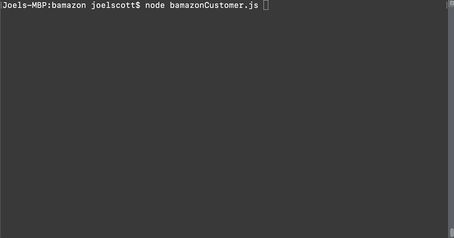
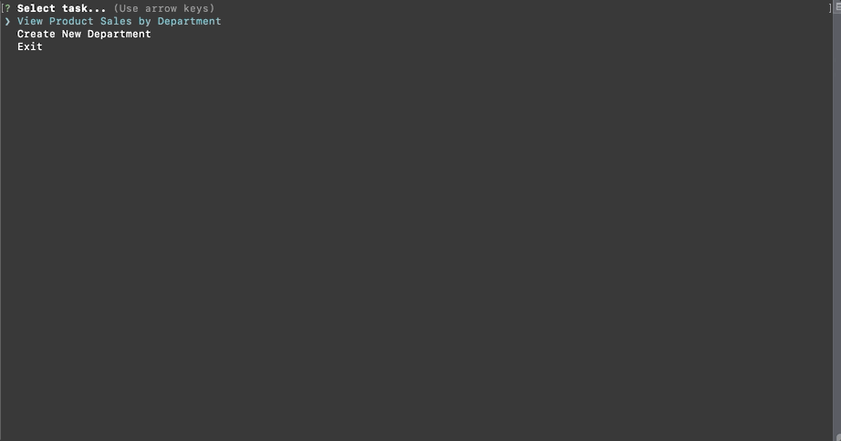

# bamazon
Bamazon is an online retailer.  
There are three node.js applications for bamazon. 
1. bamazonCustomer.js allows user make purchases from the online bamazon store
2. bamazonManager.js allows bamazon managers to see products, low inventory, order more inventory, and add new products
3. bamazonSupervisor.js allows bamazon supervisors to access data to overhead expenses, revenues, and profits by department. Supervisor can also add new departments to the bamazon store.

## bamazonCustomer.js demo 

Make purchase from the online bamazon store

## bamazonManger.js demo 

View products, view low inventory, add to inventory

Add new product

## bamazonSupervisor.js demo 

Acess overhead expenses, revenues, and profits by department
Add new department to bamazon store
